# Drusdenx — Architecture Diagrams

> Auto-generated from codebase on 2026-04-14. 24 diagrams total.

---

## 1. C4 Context — System Boundary

Who uses Drusdenx and what external systems does it touch.

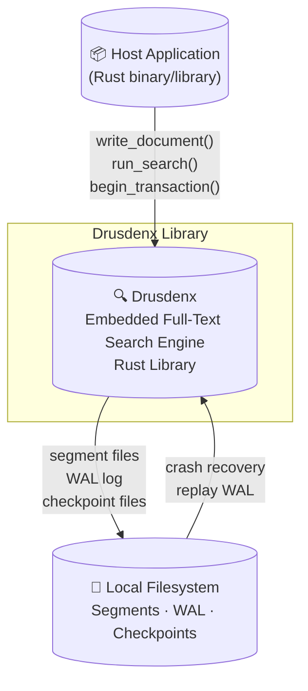
```mermaid
flowchart TB
    subgraph boundary[Drusdenx Library]
        DB[("🔍 Drusdenx\nEmbedded Full-Text Search Engine\nRust Library")]
    end

    App[("📦 Host Application\n(Rust binary/library)")]
    Disk[("💾 Local Filesystem\nSegments · WAL · Checkpoints")]

    App -->|"write_document()\nrun_search()\nbegin_transaction()"| DB
    DB -->|"segment files\nWAL log\ncheckpoint files"| Disk
    Disk -->|"crash recovery\nreplay WAL"| DB
```

---

## 2. C4 Container — Major Subsystems

The six major subsystems and how they are wired together.

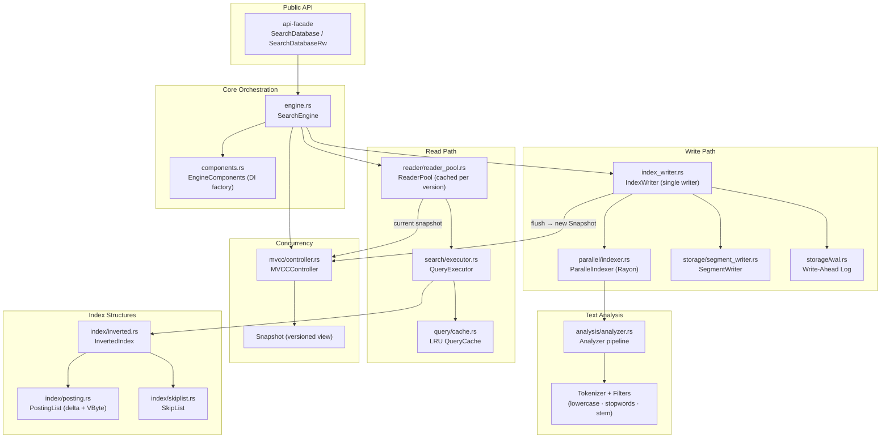
```mermaid
flowchart TB
    subgraph public[Public API]
        FAC["api-facade\nSearchDatabase / SearchDatabaseRw"]
    end

    subgraph core[Core Orchestration]
        ENG["engine.rs\nSearchEngine"]
        CMP["components.rs\nEngineComponents (DI factory)"]
    end

    subgraph write[Write Path]
        WRT["index_writer.rs\nIndexWriter (single writer)"]
        PAR["parallel/indexer.rs\nParallelIndexer (Rayon)"]
        SEG["storage/segment_writer.rs\nSegmentWriter"]
        WAL["storage/wal.rs\nWrite-Ahead Log"]
    end

    subgraph read[Read Path]
        POOL["reader/reader_pool.rs\nReaderPool (cached per version)"]
        EXEC["search/executor.rs\nQueryExecutor"]
        CACHE["query/cache.rs\nLRU QueryCache"]
    end

    subgraph mvcc[Concurrency]
        MVC["mvcc/controller.rs\nMVCCController"]
        SNAP["Snapshot (versioned view)"]
    end

    subgraph analysis[Text Analysis]
        ANA["analysis/analyzer.rs\nAnalyzer pipeline"]
        TOK["Tokenizer + Filters\n(lowercase · stopwords · stem)"]
    end

    subgraph index[Index Structures]
        INV["index/inverted.rs\nInvertedIndex"]
        POST["index/posting.rs\nPostingList (delta + VByte)"]
        SKIP["index/skiplist.rs\nSkipList"]
    end

    FAC --> ENG
    ENG --> CMP
    ENG --> WRT
    ENG --> POOL
    ENG --> MVC
    WRT --> PAR
    WRT --> SEG
    WRT --> WAL
    PAR --> ANA
    ANA --> TOK
    WRT -->|"flush → new Snapshot"| MVC
    MVC --> SNAP
    POOL -->|"current snapshot"| MVC
    POOL --> EXEC
    EXEC --> CACHE
    EXEC --> INV
    INV --> POST
    INV --> SKIP
```

---

## 3. C4 Component — Write Path Detail

Internal components involved when writing a document.

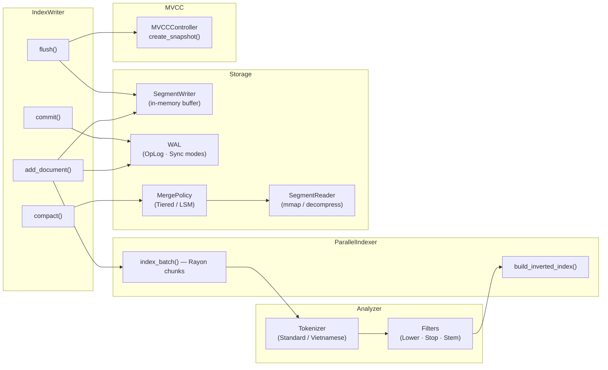
```mermaid
flowchart LR
    subgraph writer[IndexWriter]
        direction TB
        ADD["add_document()"]
        FLU["flush()"]
        COM["commit()"]
        CPT["compact()"]
    end

    subgraph parallel[ParallelIndexer]
        BAT["index_batch() — Rayon chunks"]
        BLD["build_inverted_index()"]
    end

    subgraph analysis[Analyzer]
        TKZ["Tokenizer\n(Standard / Vietnamese)"]
        FLT["Filters\n(Lower · Stop · Stem)"]
    end

    subgraph storage[Storage]
        SW["SegmentWriter\n(in-memory buffer)"]
        SR["SegmentReader\n(mmap / decompress)"]
        WAL["WAL\n(OpLog · Sync modes)"]
        MRG["MergePolicy\n(Tiered / LSM)"]
    end

    subgraph mvcc2[MVCC]
        MVC2["MVCCController\ncreate_snapshot()"]
    end

    ADD --> BAT
    BAT --> TKZ --> FLT --> BLD
    ADD --> SW
    ADD --> WAL
    FLU --> SW
    FLU --> MVC2
    COM --> WAL
    CPT --> MRG --> SR
```

---

## 4. C4 Component — Read / Query Path Detail

Internal components involved when executing a search query.

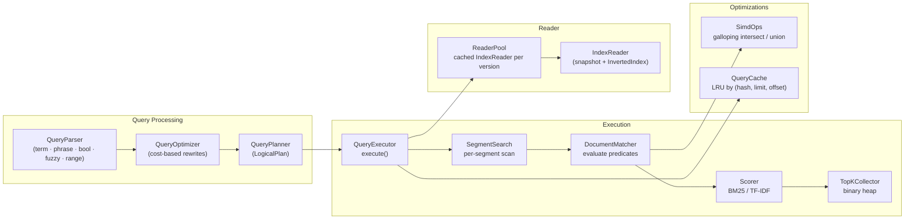
```mermaid
flowchart LR
    subgraph qparse[Query Processing]
        direction TB
        PRS["QueryParser\n(term · phrase · bool · fuzzy · range)"]
        OPT["QueryOptimizer\n(cost-based rewrites)"]
        PLN["QueryPlanner\n(LogicalPlan)"]
    end

    subgraph exec[Execution]
        direction TB
        EX["QueryExecutor\nexecute()"]
        SS["SegmentSearch\nper-segment scan"]
        MTH["DocumentMatcher\nevaluate predicates"]
        SCR["Scorer\nBM25 / TF-IDF"]
        COL["TopKCollector\nbinary heap"]
    end

    subgraph reader[Reader]
        RP["ReaderPool\ncached IndexReader per version"]
        IR["IndexReader\n(snapshot + InvertedIndex)"]
    end

    subgraph simd[Optimizations]
        SIM["SimdOps\ngalloping intersect / union"]
        LRU["QueryCache\nLRU by (hash, limit, offset)"]
    end

    PRS --> OPT --> PLN --> EX
    EX --> RP --> IR
    EX --> SS --> MTH
    MTH --> SCR --> COL
    MTH --> SIM
    EX --> LRU
```

---

## 5. Sequence — Write Document (full durability path)

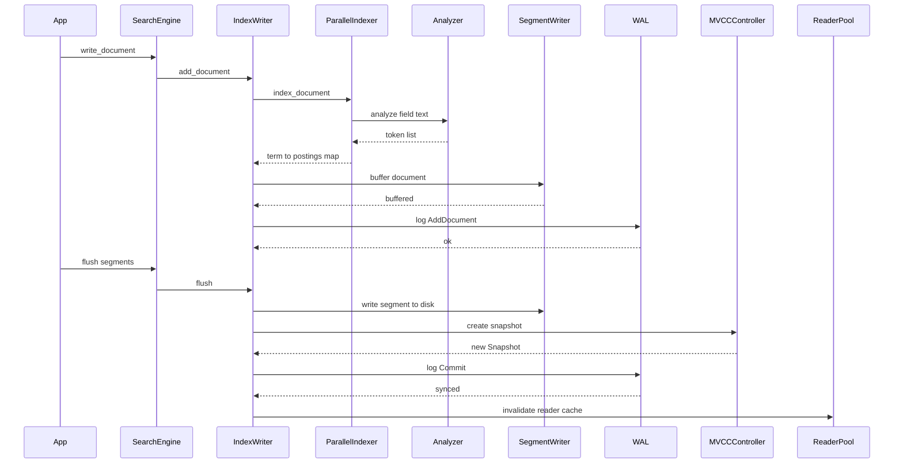
```mermaid
sequenceDiagram
    participant App
    participant Engine as SearchEngine
    participant IW as IndexWriter
    participant PIDX as ParallelIndexer
    participant ANA as Analyzer
    participant SW as SegmentWriter
    participant WAL
    participant MVC as MVCCController
    participant RP as ReaderPool
    App->>Engine: write_document
    Engine->>IW: add_document
    IW->>PIDX: index_document
    PIDX->>ANA: analyze field text
    ANA-->>PIDX: token list
    PIDX-->>IW: term to postings map
    IW->>SW: buffer document
    SW-->>IW: buffered
    IW->>WAL: log AddDocument
    WAL-->>IW: ok
    App->>Engine: flush segments
    Engine->>IW: flush
    IW->>SW: write segment to disk
    IW->>MVC: create snapshot
    MVC-->>IW: new Snapshot
    IW->>WAL: log Commit
    WAL-->>IW: synced
    IW->>RP: invalidate reader cache
```

---

## 6. Sequence — Search Query (happy path with cache miss)

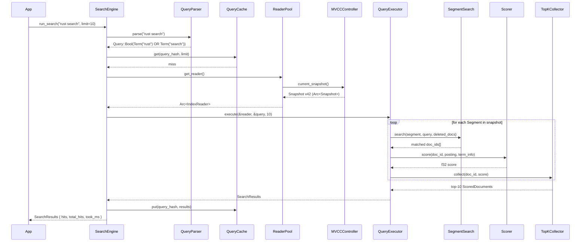
```mermaid
sequenceDiagram
    participant App
    participant Engine as SearchEngine
    participant QP as QueryParser
    participant Cache as QueryCache
    participant RP as ReaderPool
    participant MVC as MVCCController
    participant QE as QueryExecutor
    participant SS as SegmentSearch
    participant SCR as Scorer
    participant COL as TopKCollector

    App->>Engine: run_search("rust search", limit=10)
    Engine->>QP: parse("rust search")
    QP-->>Engine: Query::Bool(Term("rust") OR Term("search"))
    Engine->>Cache: get(query_hash, limit)
    Cache-->>Engine: miss

    Engine->>RP: get_reader()
    RP->>MVC: current_snapshot()
    MVC-->>RP: Snapshot v42 (Arc<Snapshot>)
    RP-->>Engine: Arc<IndexReader>

    Engine->>QE: execute(&reader, &query, 10)
    loop for each Segment in snapshot
        QE->>SS: search(segment, query, deleted_docs)
        SS-->>QE: matched doc_ids[]
        QE->>SCR: score(doc_id, posting, term_info)
        SCR-->>QE: f32 score
        QE->>COL: collect(doc_id, score)
    end
    COL-->>QE: top-10 ScoredDocuments
    QE-->>Engine: SearchResults

    Engine->>Cache: put(query_hash, results)
    Engine-->>App: SearchResults { hits, total_hits, took_ms }
```

---

## 7. State Diagram — Document Lifecycle

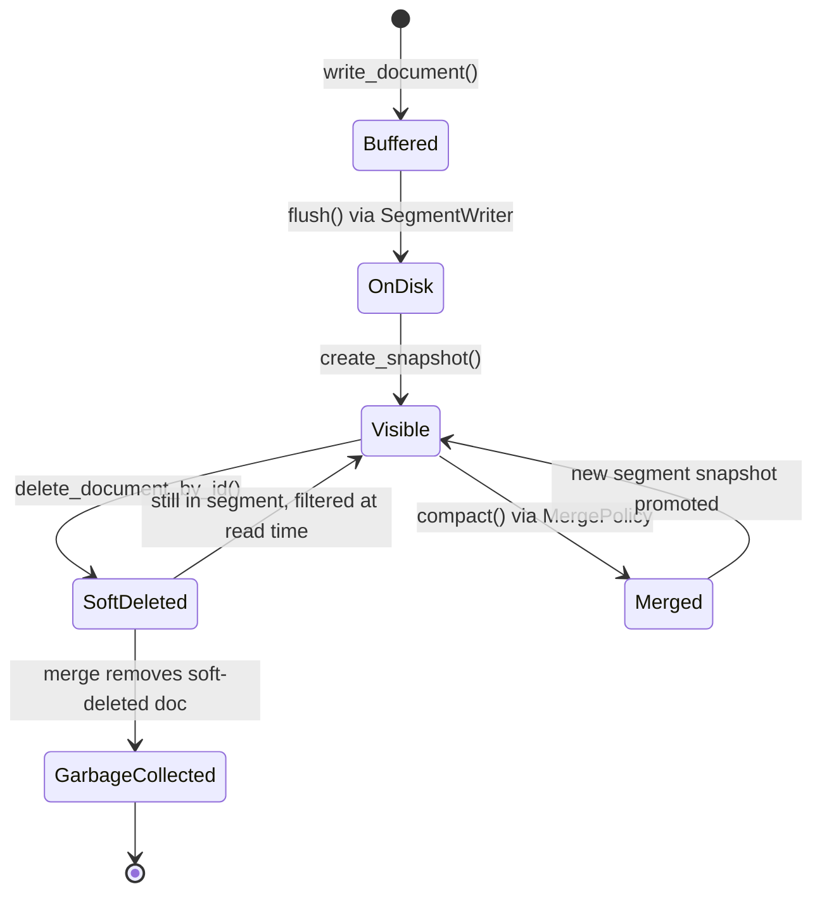
```mermaid
stateDiagram-v2
    [*] --> Buffered : write_document()
    Buffered --> OnDisk : flush() via SegmentWriter
    OnDisk --> Visible : create_snapshot()
    Visible --> SoftDeleted : delete_document_by_id()
    SoftDeleted --> Visible : still in segment, filtered at read time
    Visible --> Merged : compact() via MergePolicy
    Merged --> Visible : new segment snapshot promoted
    SoftDeleted --> GarbageCollected : merge removes soft-deleted doc
    GarbageCollected --> [*]
```

---

## 8. State Diagram — MVCC Snapshot Lifecycle

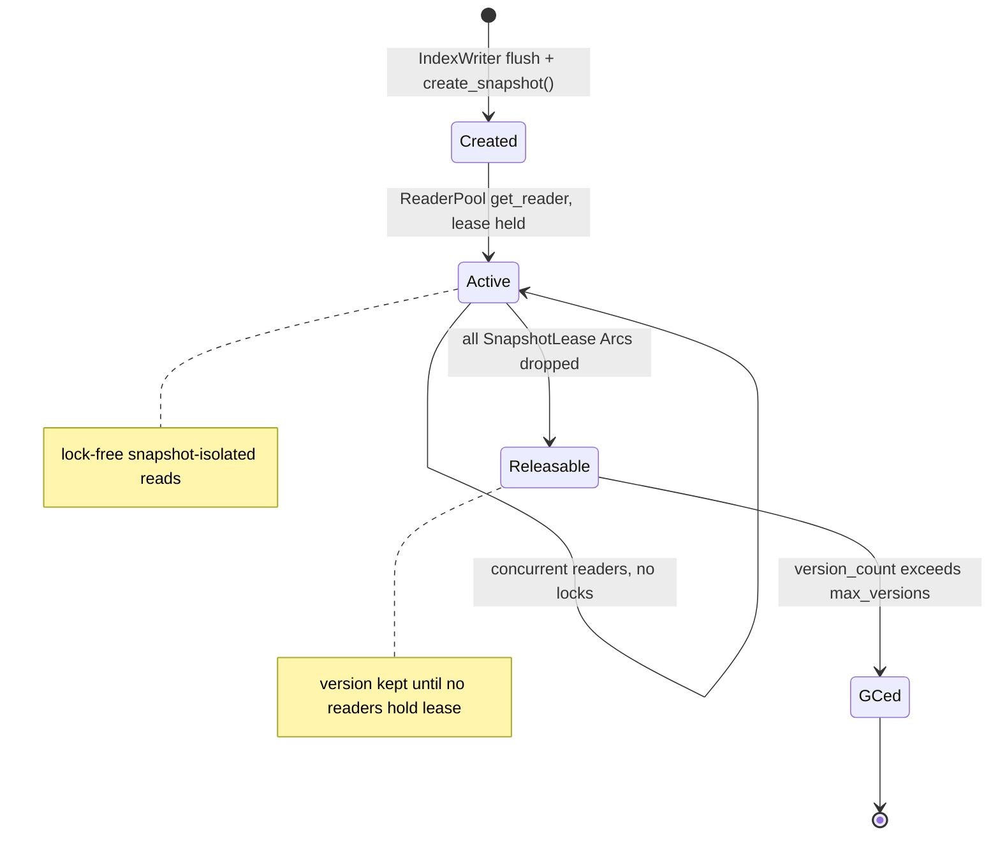
```mermaid
stateDiagram-v2
    [*] --> Created : IndexWriter flush + create_snapshot()
    Created --> Active : ReaderPool get_reader, lease held
    Active --> Active : concurrent readers, no locks
    Active --> Releasable : all SnapshotLease Arcs dropped
    Releasable --> GCed : version_count exceeds max_versions
    GCed --> [*]
    note right of Active : lock-free snapshot-isolated reads
    note right of Releasable : version kept until no readers hold lease
```

---

## 9. Class — Core Domain Types

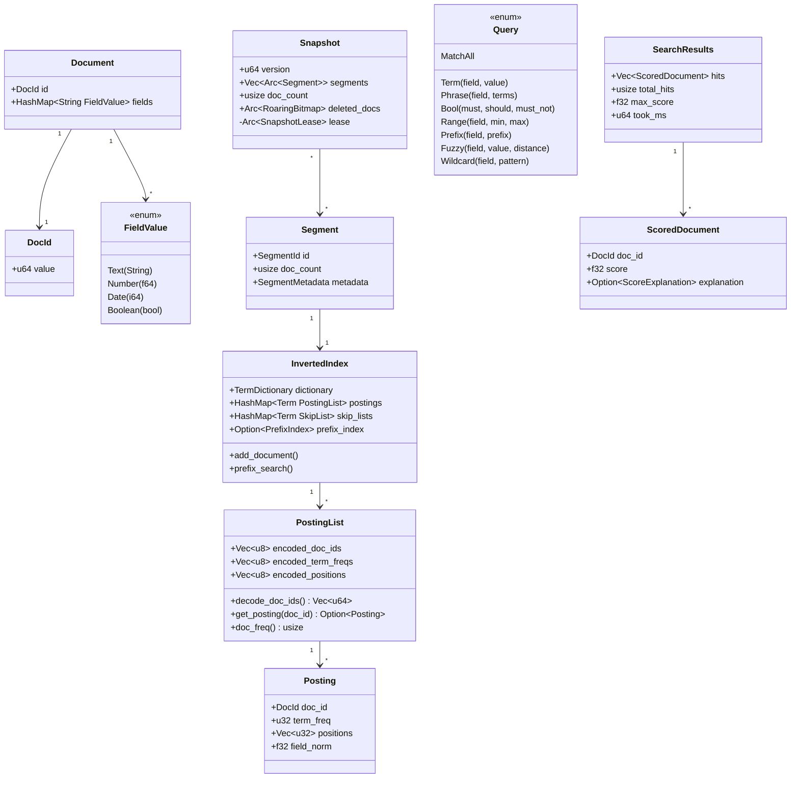
```mermaid
classDiagram
    class Document {
        +DocId id
        +HashMap~String FieldValue~ fields
    }

    class DocId {
        +u64 value
    }

    class FieldValue {
        <<enum>>
        Text(String)
        Number(f64)
        Date(i64)
        Boolean(bool)
    }

    class Snapshot {
        +u64 version
        +Vec~Arc~Segment~~ segments
        +usize doc_count
        +Arc~RoaringBitmap~ deleted_docs
        -Arc~SnapshotLease~ lease
    }

    class Segment {
        +SegmentId id
        +usize doc_count
        +SegmentMetadata metadata
    }

    class InvertedIndex {
        +TermDictionary dictionary
        +HashMap~Term PostingList~ postings
        +HashMap~Term SkipList~ skip_lists
        +Option~PrefixIndex~ prefix_index
        +add_document()
        +prefix_search()
    }

    class PostingList {
        +Vec~u8~ encoded_doc_ids
        +Vec~u8~ encoded_term_freqs
        +Vec~u8~ encoded_positions
        +decode_doc_ids() Vec~u64~
        +get_posting(doc_id) Option~Posting~
        +doc_freq() usize
    }

    class Posting {
        +DocId doc_id
        +u32 term_freq
        +Vec~u32~ positions
        +f32 field_norm
    }

    class Query {
        <<enum>>
        Term(field, value)
        Phrase(field, terms)
        Bool(must, should, must_not)
        Range(field, min, max)
        Prefix(field, prefix)
        Fuzzy(field, value, distance)
        Wildcard(field, pattern)
        MatchAll
    }

    class SearchResults {
        +Vec~ScoredDocument~ hits
        +usize total_hits
        +f32 max_score
        +u64 took_ms
    }

    class ScoredDocument {
        +DocId doc_id
        +f32 score
        +Option~ScoreExplanation~ explanation
    }

    Document "1" --> "1" DocId
    Document "1" --> "*" FieldValue
    Snapshot "*" --> "*" Segment
    Segment "1" --> "1" InvertedIndex
    InvertedIndex "1" --> "*" PostingList
    PostingList "1" --> "*" Posting
    SearchResults "1" --> "*" ScoredDocument
```

---

## 10. Flowchart — Concurrency Model

How single-writer and multi-reader concurrency is achieved.

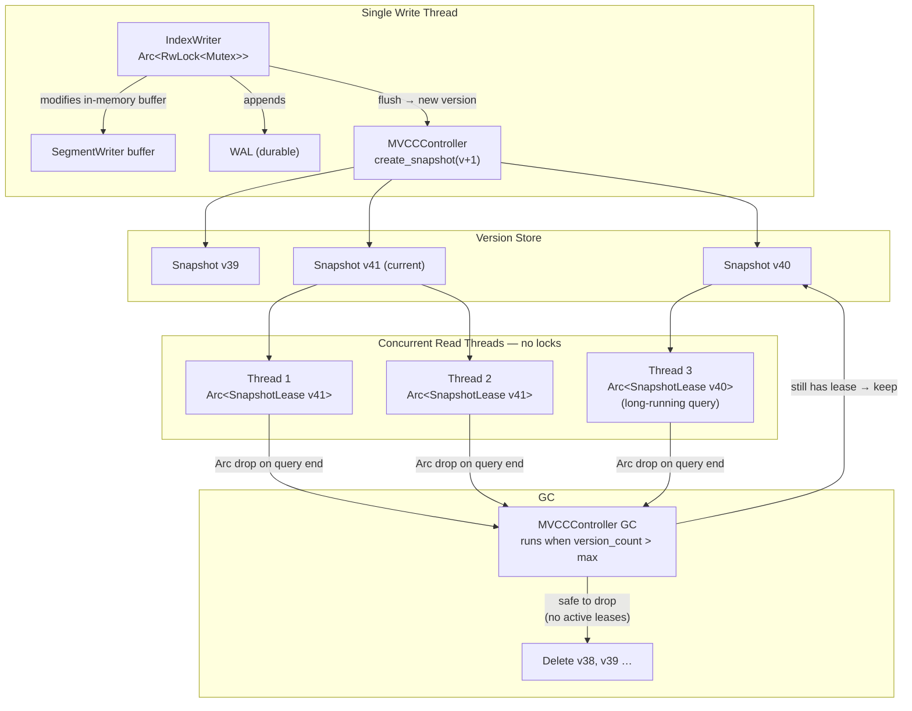
```mermaid
flowchart TB
    subgraph single[Single Write Thread]
        W1["IndexWriter\nArc&lt;RwLock&lt;Mutex&gt;&gt;"]
        W1 -->|"modifies in-memory buffer"| BUF["SegmentWriter buffer"]
        W1 -->|"appends"| WAL2["WAL (durable)"]
        W1 -->|"flush → new version"| MVC3["MVCCController\ncreate_snapshot(v+1)"]
    end

    subgraph versions[Version Store]
        MVC3 --> V1["Snapshot v39"]
        MVC3 --> V2["Snapshot v40"]
        MVC3 --> V3["Snapshot v41 (current)"]
    end

    subgraph readers[Concurrent Read Threads — no locks]
        R1["Thread 1\nArc&lt;SnapshotLease v41&gt;"]
        R2["Thread 2\nArc&lt;SnapshotLease v41&gt;"]
        R3["Thread 3\nArc&lt;SnapshotLease v40&gt;\n(long-running query)"]
    end

    subgraph gc[GC]
        GC1["MVCCController GC\nruns when version_count &gt; max"]
        GC1 -->|"safe to drop\n(no active leases)"| DEL["Delete v38, v39 …"]
        GC1 -->|"still has lease → keep"| V2
    end

    V3 --> R1
    V3 --> R2
    V2 --> R3
    R1 -->|"Arc drop on query end"| GC1
    R2 -->|"Arc drop on query end"| GC1
    R3 -->|"Arc drop on query end"| GC1
```

---

## 11. Flowchart — WAL Recovery on Crash

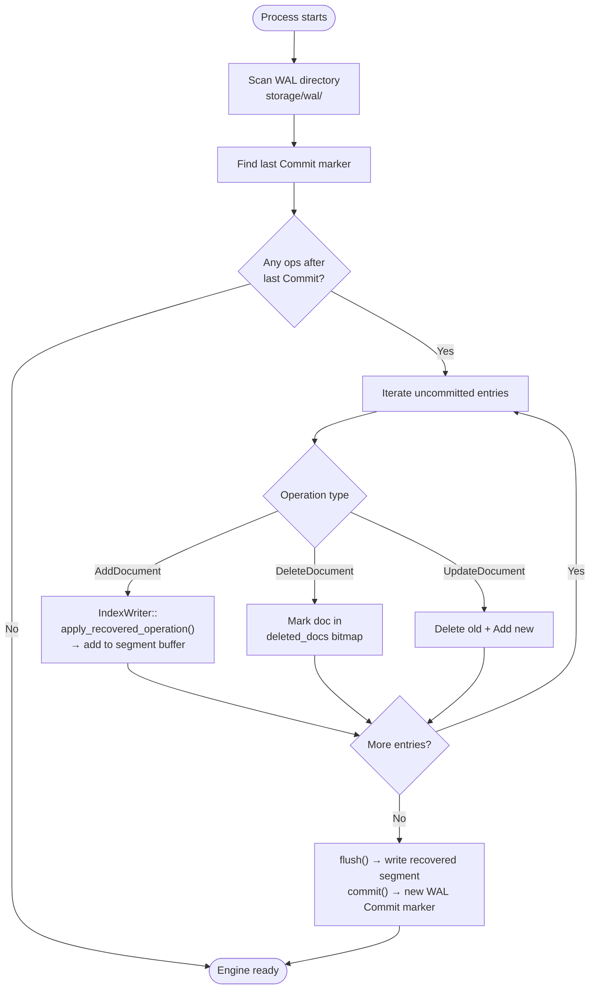
```mermaid
flowchart TD
    START([Process starts]) --> SCAN["Scan WAL directory\nstorage/wal/"]
    SCAN --> FIND["Find last Commit marker"]
    FIND --> REPLAY{Any ops after\nlast Commit?}
    REPLAY -->|No| READY([Engine ready])
    REPLAY -->|Yes| ITER["Iterate uncommitted entries"]
    ITER --> OP{Operation type}
    OP -->|AddDocument| APPLY1["IndexWriter::\napply_recovered_operation()\n→ add to segment buffer"]
    OP -->|DeleteDocument| APPLY2["Mark doc in\ndeleted_docs bitmap"]
    OP -->|UpdateDocument| APPLY3["Delete old + Add new"]
    APPLY1 --> MORE{More entries?}
    APPLY2 --> MORE
    APPLY3 --> MORE
    MORE -->|Yes| ITER
    MORE -->|No| FLUSH["flush() → write recovered segment\ncommit() → new WAL Commit marker"]
    FLUSH --> READY
```

---

## 12. ER Diagram — Persisted Storage Layout

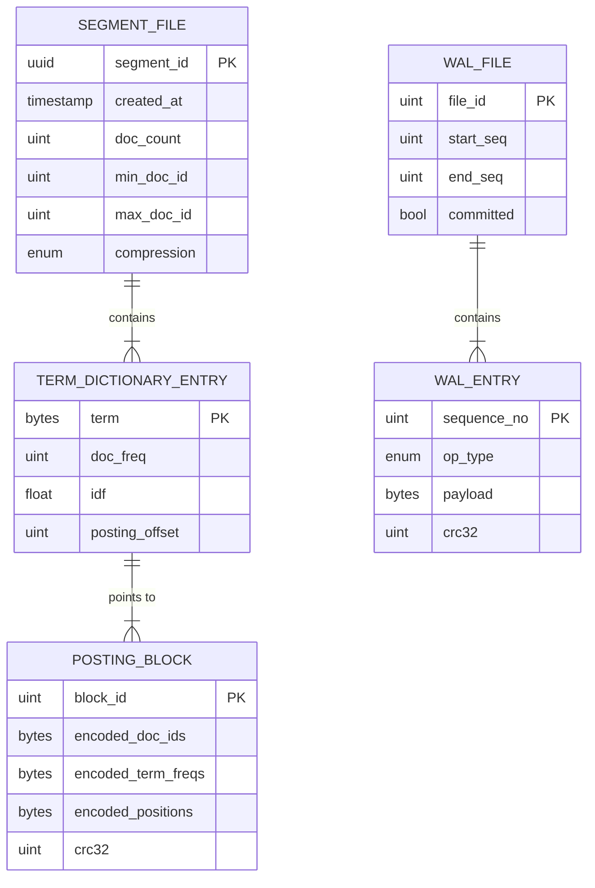
```mermaid
erDiagram
    SEGMENT_FILE {
        uuid segment_id PK
        timestamp created_at
        uint doc_count
        uint min_doc_id
        uint max_doc_id
        enum compression
    }

    TERM_DICTIONARY_ENTRY {
        bytes term PK
        uint doc_freq
        float idf
        uint posting_offset
    }

    POSTING_BLOCK {
        uint block_id PK
        bytes encoded_doc_ids
        bytes encoded_term_freqs
        bytes encoded_positions
        uint crc32
    }

    WAL_ENTRY {
        uint sequence_no PK
        enum op_type
        bytes payload
        uint crc32
    }

    WAL_FILE {
        uint file_id PK
        uint start_seq
        uint end_seq
        bool committed
    }

    SEGMENT_FILE ||--|{ TERM_DICTIONARY_ENTRY : "contains"
    TERM_DICTIONARY_ENTRY ||--|{ POSTING_BLOCK : "points to"
    WAL_FILE ||--|{ WAL_ENTRY : "contains"
```

---

## 13. Flowchart — Text Analysis Pipeline

Every field value goes through this pipeline before indexing or querying.

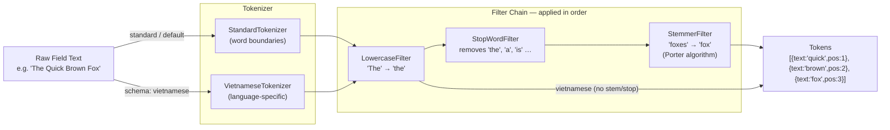
```mermaid
flowchart LR
    RAW["Raw Field Text\ne.g. 'The Quick Brown Fox'"]

    subgraph tokenizer[Tokenizer]
        direction TB
        STD["StandardTokenizer\n(word boundaries)"]
        VIE["VietnameseTokenizer\n(language-specific)"]
    end

    RAW -->|"standard / default"| STD
    RAW -->|"schema: vietnamese"| VIE

    subgraph filters[Filter Chain — applied in order]
        direction LR
        LC["LowercaseFilter\n'The' → 'the'"]
        SW["StopWordFilter\nremoves 'the', 'a', 'is' …"]
        ST["StemmerFilter\n'foxes' → 'fox'\n(Porter algorithm)"]
    end

    STD --> LC --> SW --> ST
    VIE --> LC

    OUT["Tokens\n[{text:'quick',pos:1}, {text:'brown',pos:2}, {text:'fox',pos:3}]"]
    ST --> OUT
    LC -->|"vietnamese (no stem/stop)"| OUT
```

---

## 14. Flowchart — Analyzer Registry Lookup

How a schema-level per-field analyzer is resolved at index and query time.

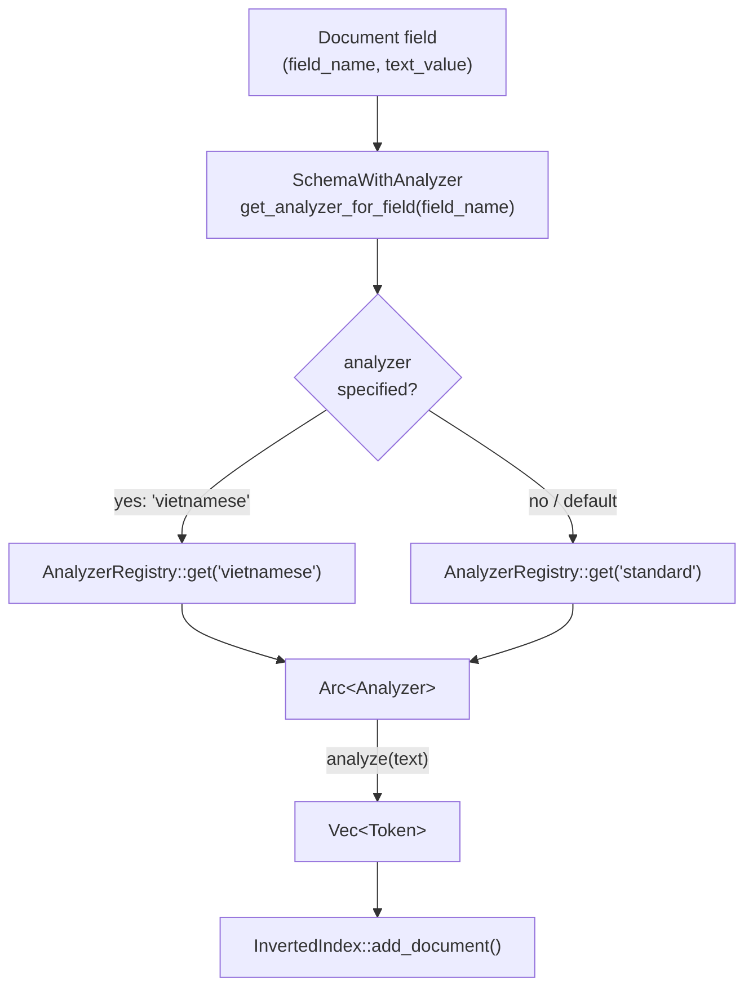
```mermaid
flowchart TD
    DOC["Document field\n(field_name, text_value)"]
    SCHEMA["SchemaWithAnalyzer\nget_analyzer_for_field(field_name)"]
    DOC --> SCHEMA

    SCHEMA --> FOUND{analyzer\nspecified?}
    FOUND -->|"yes: 'vietnamese'"| REG["AnalyzerRegistry::get('vietnamese')"]
    FOUND -->|"no / default"| DEF["AnalyzerRegistry::get('standard')"]

    REG --> ANA["Arc&lt;Analyzer&gt;"]
    DEF --> ANA

    ANA -->|"analyze(text)"| TOK["Vec&lt;Token&gt;"]
    TOK --> IDX["InvertedIndex::add_document()"]
```

---

## 15. Flowchart — Compression Decision Tree

How data type determines which encoding + compression to apply.

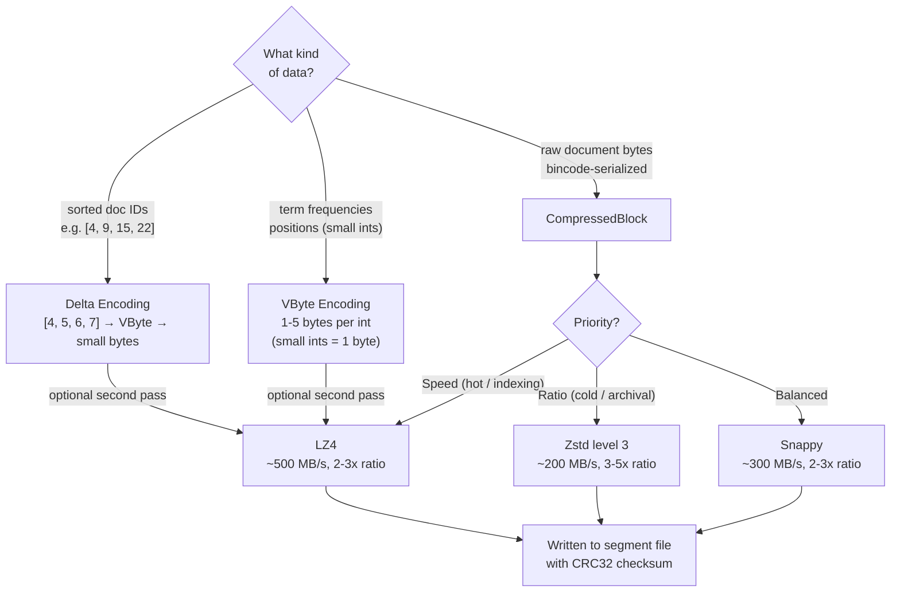
```mermaid
flowchart TD
    DATA{What kind\nof data?}

    DATA -->|"sorted doc IDs\ne.g. [4, 9, 15, 22]"| DELTA["Delta Encoding\n[4, 5, 6, 7] → VByte → small bytes"]
    DATA -->|"term frequencies\npositions (small ints)"| VBYTE["VByte Encoding\n1-5 bytes per int\n(small ints = 1 byte)"]
    DATA -->|"raw document bytes\nbincode-serialized"| BLOCK["CompressedBlock"]

    BLOCK --> PRI{Priority?}
    PRI -->|"Speed (hot / indexing)"| LZ4["LZ4\n~500 MB/s, 2-3x ratio"]
    PRI -->|"Ratio (cold / archival)"| ZSTD["Zstd level 3\n~200 MB/s, 3-5x ratio"]
    PRI -->|"Balanced"| SNAP["Snappy\n~300 MB/s, 2-3x ratio"]

    DELTA -->|"optional second pass"| LZ4
    VBYTE -->|"optional second pass"| LZ4

    LZ4 --> DISK["Written to segment file\nwith CRC32 checksum"]
    ZSTD --> DISK
    SNAP --> DISK
```

---

## 16. Class — Query AST

All query variants with their fields, showing how boolean nesting works.

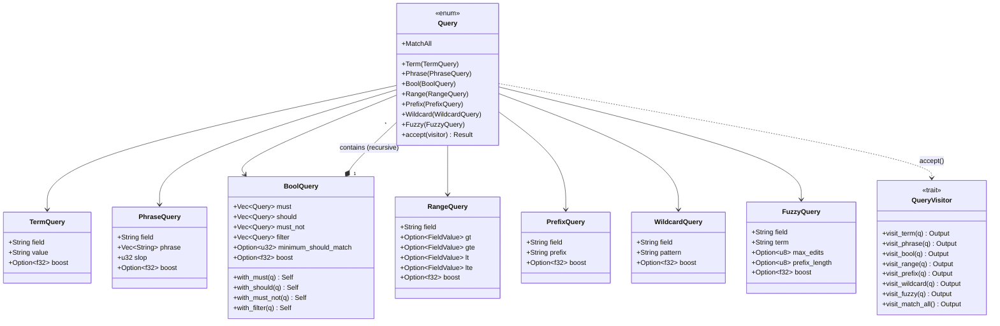
```mermaid
classDiagram
    class Query {
        <<enum>>
        +Term(TermQuery)
        +Phrase(PhraseQuery)
        +Bool(BoolQuery)
        +Range(RangeQuery)
        +Prefix(PrefixQuery)
        +Wildcard(WildcardQuery)
        +Fuzzy(FuzzyQuery)
        +MatchAll
        +accept(visitor) Result
    }

    class TermQuery {
        +String field
        +String value
        +Option~f32~ boost
    }

    class PhraseQuery {
        +String field
        +Vec~String~ phrase
        +u32 slop
        +Option~f32~ boost
    }

    class BoolQuery {
        +Vec~Query~ must
        +Vec~Query~ should
        +Vec~Query~ must_not
        +Vec~Query~ filter
        +Option~u32~ minimum_should_match
        +Option~f32~ boost
        +with_must(q) Self
        +with_should(q) Self
        +with_must_not(q) Self
        +with_filter(q) Self
    }

    class RangeQuery {
        +String field
        +Option~FieldValue~ gt
        +Option~FieldValue~ gte
        +Option~FieldValue~ lt
        +Option~FieldValue~ lte
        +Option~f32~ boost
    }

    class PrefixQuery {
        +String field
        +String prefix
        +Option~f32~ boost
    }

    class WildcardQuery {
        +String field
        +String pattern
        +Option~f32~ boost
    }

    class FuzzyQuery {
        +String field
        +String term
        +Option~u8~ max_edits
        +Option~u8~ prefix_length
        +Option~f32~ boost
    }

    class QueryVisitor {
        <<trait>>
        +visit_term(q) Output
        +visit_phrase(q) Output
        +visit_bool(q) Output
        +visit_range(q) Output
        +visit_prefix(q) Output
        +visit_wildcard(q) Output
        +visit_fuzzy(q) Output
        +visit_match_all() Output
    }

    Query --> TermQuery
    Query --> PhraseQuery
    Query --> BoolQuery
    Query --> RangeQuery
    Query --> PrefixQuery
    Query --> WildcardQuery
    Query --> FuzzyQuery
    BoolQuery "1" *-- "*" Query : contains (recursive)
    Query ..> QueryVisitor : accept()
```

---

## 17. Flowchart — BoolQuery Evaluation

How `must`, `should`, `must_not`, and `filter` clauses combine at query execution time.

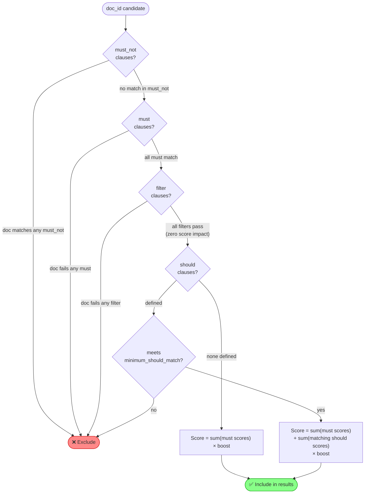
```mermaid
flowchart TD
    START(["doc_id candidate"]) --> MN{must_not\nclauses?}
    MN -->|"doc matches any must_not"| REJECT(["❌ Exclude"])
    MN -->|"no match in must_not"| MUST{must\nclauses?}

    MUST -->|"doc fails any must"| REJECT
    MUST -->|"all must match"| FILT{filter\nclauses?}

    FILT -->|"doc fails any filter"| REJECT
    FILT -->|"all filters pass\n(zero score impact)"| SHD{should\nclauses?}

    SHD -->|"none defined"| SCORE["Score = sum(must scores) × boost"]
    SHD -->|"defined"| MSM{meets\nminimum_should_match?}

    MSM -->|"no"| REJECT
    MSM -->|"yes"| SCORE2["Score = sum(must scores)\n+ sum(matching should scores)\n× boost"]

    SCORE --> ACCEPT(["✅ Include in results"])
    SCORE2 --> ACCEPT

    style REJECT fill:#f88,stroke:#c00
    style ACCEPT fill:#8f8,stroke:#090
```

---

## 18. Flowchart — SimdOps Galloping Intersection

How `intersect_sorted` skips chunks of posting lists to speed up AND queries.

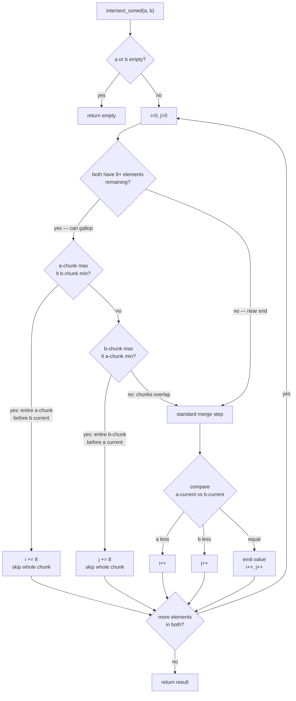
```mermaid
flowchart TD
    START["intersect_sorted(a, b)"]
    START --> EMPTY{a or b empty?}
    EMPTY -->|"yes"| RET_EMPTY["return empty"]
    EMPTY -->|"no"| LOOP["i=0, j=0"]
    LOOP --> BOUNDS{both have 8+ elements\nremaining?}
    BOUNDS -->|"yes — can gallop"| GCHK1{a-chunk max\nlt b-chunk min?}
    GCHK1 -->|"yes: entire a-chunk\nbefore b current"| SKIP_A["i += 8\nskip whole chunk"]
    GCHK1 -->|"no"| GCHK2{b-chunk max\nlt a-chunk min?}
    GCHK2 -->|"yes: entire b-chunk\nbefore a current"| SKIP_B["j += 8\nskip whole chunk"]
    GCHK2 -->|"no: chunks overlap"| STD["standard merge step"]
    BOUNDS -->|"no — near end"| STD
    STD --> CMP{compare\na-current vs b-current}
    CMP -->|"a less"| ADV_A["i++"]
    CMP -->|"b less"| ADV_B["j++"]
    CMP -->|"equal"| EMIT["emit value\ni++, j++"]
    SKIP_A --> DONE{more elements\nin both?}
    SKIP_B --> DONE
    ADV_A --> DONE
    ADV_B --> DONE
    EMIT --> DONE
    DONE -->|"yes"| LOOP
    DONE -->|"no"| RESULT["return result"]
```

---

## 19. Sequence — Transaction with 2-Phase Commit

Full lifecycle of a serializable transaction including OCC validation.

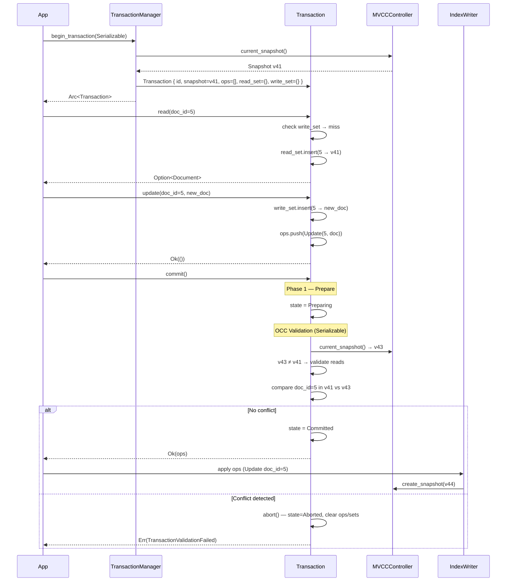
```mermaid
sequenceDiagram
    participant App
    participant TM as TransactionManager
    participant TX as Transaction
    participant MVC as MVCCController
    participant IW as IndexWriter

    App->>TM: begin_transaction(Serializable)
    TM->>MVC: current_snapshot()
    MVC-->>TM: Snapshot v41
    TM->>TX: Transaction { id, snapshot=v41, ops=[], read_set={}, write_set={} }
    TM-->>App: Arc<Transaction>

    App->>TX: read(doc_id=5)
    TX->>TX: check write_set → miss
    TX->>TX: read_set.insert(5 → v41)
    TX-->>App: Option<Document>

    App->>TX: update(doc_id=5, new_doc)
    TX->>TX: write_set.insert(5 → new_doc)
    TX->>TX: ops.push(Update(5, doc))
    TX-->>App: Ok(())

    App->>TX: commit()
    Note over TX: Phase 1 — Prepare
    TX->>TX: state = Preparing

    Note over TX: OCC Validation (Serializable)
    TX->>MVC: current_snapshot() → v43
    TX->>TX: v43 ≠ v41 → validate reads
    TX->>TX: compare doc_id=5 in v41 vs v43

    alt No conflict
        TX->>TX: state = Committed
        TX-->>App: Ok(ops)
        App->>IW: apply ops (Update doc_id=5)
        IW->>MVC: create_snapshot(v44)
    else Conflict detected
        TX->>TX: abort() — state=Aborted, clear ops/sets
        TX-->>App: Err(TransactionValidationFailed)
    end
```

---

## 20. State Diagram — Transaction Lifecycle

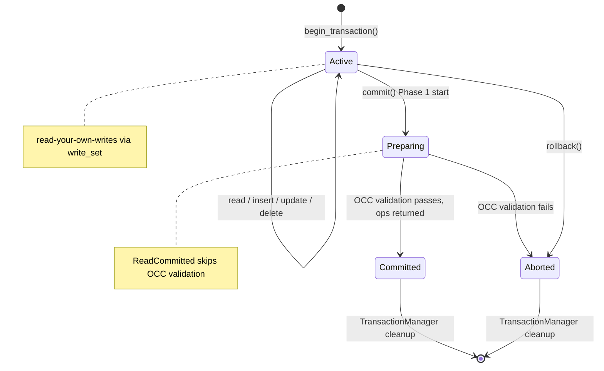
```mermaid
stateDiagram-v2
    [*] --> Active : begin_transaction()
    Active --> Active : read / insert / update / delete
    Active --> Preparing : commit() Phase 1 start
    Preparing --> Committed : OCC validation passes, ops returned
    Preparing --> Aborted : OCC validation fails
    Active --> Aborted : rollback()
    Committed --> [*] : TransactionManager cleanup
    Aborted --> [*] : TransactionManager cleanup
    note right of Active : read-your-own-writes via write_set
    note right of Preparing : ReadCommitted skips OCC validation
```

---

## 21. Flowchart — Isolation Level Behaviour

How each isolation level changes read and conflict-detection behaviour.

```mermaid
flowchart LR
    subgraph RC[ReadCommitted]
        direction TB
        RC1["read() → always latest committed snapshot"]
        RC2["commit() → NO read-set validation"]
        RC3["Risk: non-repeatable reads"]
    end

    subgraph RR[RepeatableRead]
        direction TB
        RR1["read() → snapshot taken at tx.begin()"]
        RR2["commit() → validate read_set vs current snapshot"]
        RR3["Abort if any read doc changed"]
    end

    subgraph SER[Serializable]
        direction TB
        SER1["read() → snapshot taken at tx.begin()"]
        SER2["commit() → validate read_set + write_set + ops"]
        SER3["Abort on ANY overlap with concurrent writes"]
    end

    APP["Application\nchooses IsolationLevel"] --> RC
    APP --> RR
    APP --> SER

    style RC fill:#ffe0b2
    style RR fill:#fff9c4
    style SER fill:#c8e6c9
```

---

## 22. Flowchart — Segment Merge Decision (Tiered Policy)

```mermaid
flowchart TD
    TRIG["compact() called"] --> CNT{segment_count\ngt max_per_tier 10?}
    CNT -->|"yes"| MERGE_YES["trigger merge"]
    CNT -->|"no"| SMALL{small segments\nlt 10 MB, count ≥ min_to_merge 2?}
    SMALL -->|"yes"| MERGE_YES
    SMALL -->|"no"| SKIP["no merge needed"]
    MERGE_YES --> SORT["sort segments by size_bytes ASC"]
    SORT --> SEL["pick smallest segments\nfitting within 512 MB cap\nstop at max_to_merge 10"]
    SEL --> COUNT{selected count\n≥ min_to_merge 2?}
    COUNT -->|"no"| SKIP
    COUNT -->|"yes"| DO_MERGE["SegmentMerger::merge selected\nread all postings\nmerge inverted indexes\nwrite new segment"]
    DO_MERGE --> SNAP["MVCCController::create_snapshot\nnew segment list"]
    SNAP --> DEL["delete old segment files"]
```

---

## 23. Flowchart — Segment Merge Decision (LSM Policy)

```mermaid
flowchart TD
    TRIG2(["compact() called"]) --> TIER["assign each segment to tier\ntier = floor(log(size / min_size) / log(ratio=10))"]
    TIER --> CHECK{any tier\nhas ≥ 4 segments?}
    CHECK -->|"no"| SKIP2(["no merge needed"])
    CHECK -->|"yes"| FIND["find first overflowing tier"]
    FIND --> DO2["merge all segments in that tier\n→ new combined segment at tier+1"]
    DO2 --> PROMOTE["promotes data up the levels\n(write-heavy optimised path)"]

    subgraph levels[Level Sizes — ratio=10x]
        L0["Level 0: 1 MB segments"]
        L1["Level 1: 10 MB segments"]
        L2["Level 2: 100 MB segments"]
        L3["Level 3: 1 GB segments"]
        L0 --> L1 --> L2 --> L3
    end
```

---

## 24. Flowchart — Memory Architecture

Three layers of memory management and how they interact.

```mermaid
flowchart TB
    subgraph pool[MemoryPool — fixed-size block arena]
        direction LR
        B0["Block 0\n(1 MB, free)"]
        B1["Block 1\n(1 MB, in use)"]
        BN["Block N\n(1 MB, free)"]
        FL["free_list: VecDeque&lt;BlockId&gt;"]
        AT["AtomicBool in_use per block"]
    end

    subgraph buf[BufferPool — page-based I/O cache]
        direction LR
        PG["Pages (4 MB total)"]
        PG --> EVICT["LRU eviction when full"]
    end

    subgraph tracker[MemoryTracker — global limit guard]
        direction LR
        USG["AtomicUsize usage"]
        LIM["usize limit (config)"]
        USG --> CHK{usage + req\n> limit?}
        CHK -->|"yes"| OOM["Err(OutOfMemory)"]
        CHK -->|"no"| OK["Ok — allocate"]
    end

    subgraph low[LowMemoryMode — pressure response]
        P1["Pressure: Normal"]
        P2["Pressure: High"]
        P3["Pressure: Critical"]
        P1 --> P2 --> P3
        P3 --> RECLAIM["reclaim:\n• flush caches\n• drop old snapshots\n• trim reader pool"]
    end

    IW["IndexWriter\n(allocates doc buffers)"] --> pool
    SR["SegmentReader\n(I/O pages)"] --> buf
    ENG["SearchEngine\n(global limit)"] --> tracker
    tracker --> low
    pool -.-> tracker
    buf -.-> tracker
```
